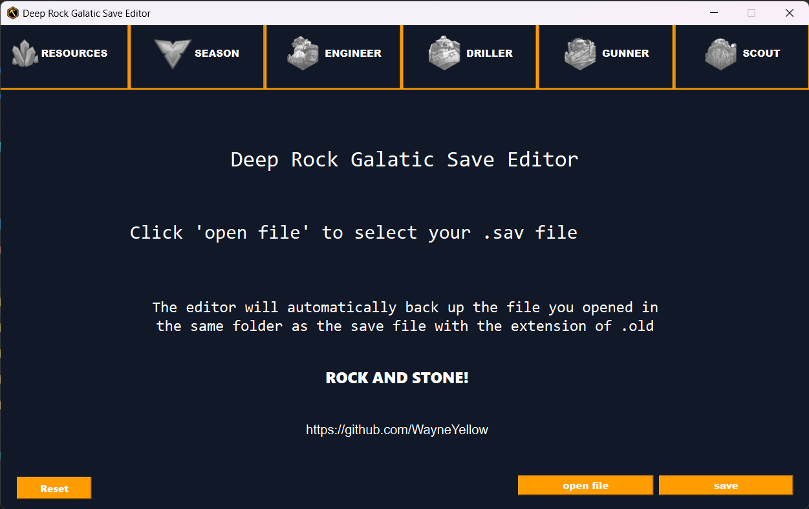
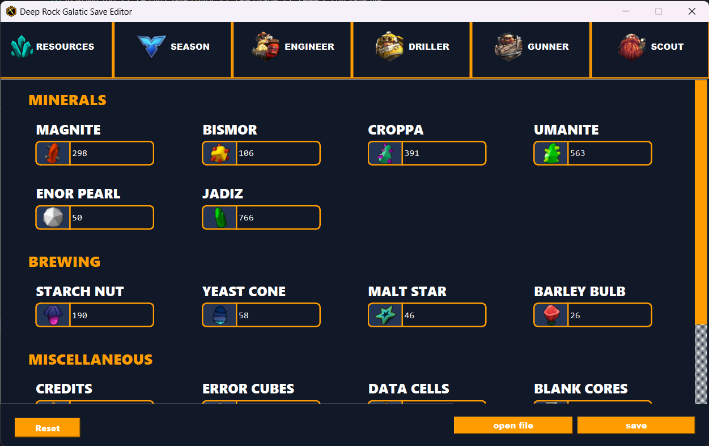

# DRG Save Editor


Deep Rock Galactic Save Editor is a tool for editing save files of the game Deep Rock Galactic. It is written in Python and uses PyQt6 for the GUI. 
## Features
- Edit resources
- Edit season 4 progress
- Edit credits
- Edit perk points
- Edit dwarf level
- Unlock Overclocks
- Automatically backup

## Quick setup
Two setup methods are provided:
### 1. release executable(recommended):
This is a quick and easy way to use the editor. Good for users who don't have Python installed.
- Download the .zip file from the [releases](https://github.com/WayneYellow/Deep-Rock-Galactic-Save-Editor/releases)
- Extract the .zip file
- Run the .exe file (Deep-Rock-Galactic-Save-Editor-1.0.0.exe)
- you should be able to use it now, for usage guide, see [Usage](#usage)

### 2. running source code:
If you have python(>=3.7) and git installed on your computer, you can run the source code directly by following commands:
- clone the repository
```bash
git clone https://github.com/WayneYellow/Deep-Rock-Galactic-Save-Editor.git
```
- install dependencies
```bash
pip install -r requirements.txt
```
- switch to the directory
```bash
cd ./src
```
- run the mian.py
```bash
python main.py
```
- you should be able to use it now, for usage guide, see [Usage](#usage)

## Usage
### 1. Select save file
- Click the "open file" button and select the save file you want to edit. The editor will automatically open the folder where the save file is located. If not, the save file is usually located at your steam game folder, the path should be something like this:
```
~\Steam\steamapps\common\Deep Rock Galactic\FSD\Saved\SaveGames
```
- Once you select the save file, the editor will automatically backup the save file to the same folder. The backup file will be named as extension of .old, for example, if your save file is named "save.sav", the backup file will be named "save.sav.old". You can restore the backup file by renaming it to "save.sav".

### 2. Edit save file
- use the editor to edit the save file

### 3. Save changes
- Once you finish editing, click the "save" button to save the changes.

## Known issues
- None.

If you encounter any issues, please report it in the [issues](https://github.com/WayneYellow/Deep-Rock-Galactic-Save-Editor/issues)

## License
[MIT](https://choosealicense.com/licenses/mit/)
